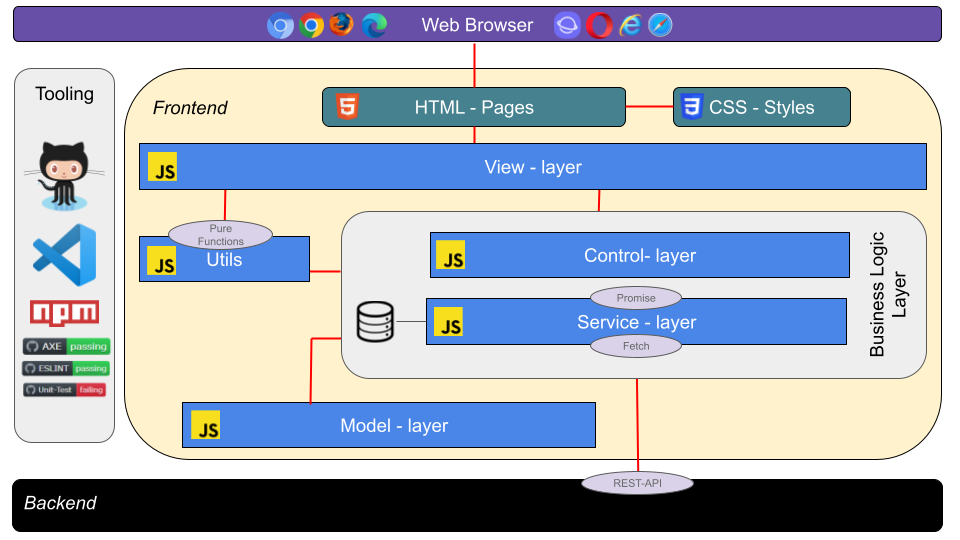
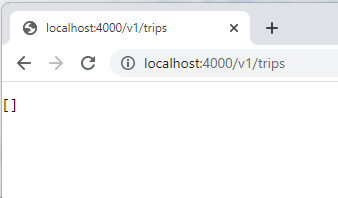
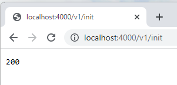
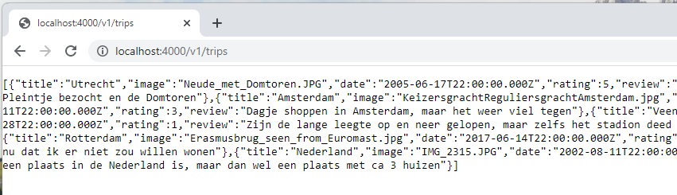
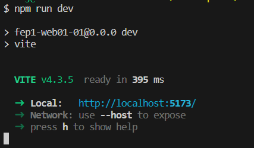
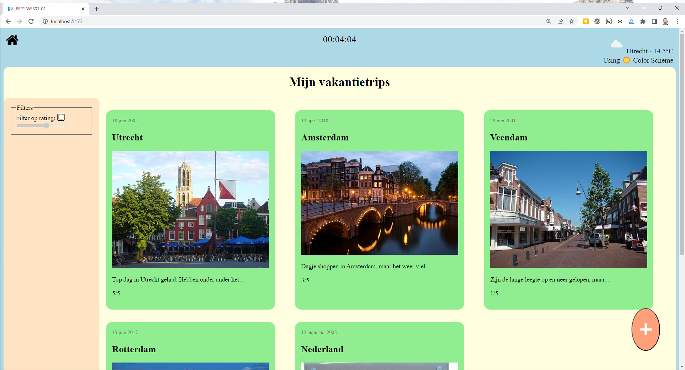
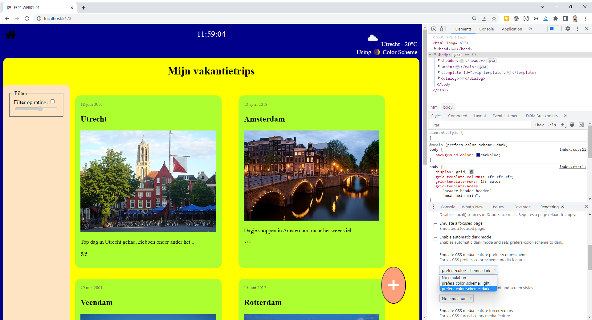
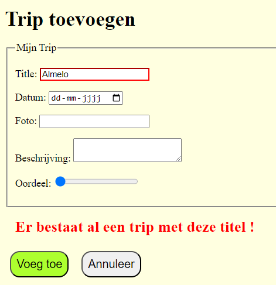

# WEB - Hier komt alles samen

## Introductie

In deze laatste assignment combineren we alle frontend kennis en creëren we een dynamische website doordat we de HTML en CSS code in de browser met behulp van JavaScript gaan manipuleren.

### Architectuur

Deze frontend maakt gebruik van in de behandelde Front-End architectuur. Een architectuur van het **MV\* (model-view-whatever)** pattern, waar het **Model-View-Controller (MVC)** pattern ook onder valt. De HTML Pagina die van de browser wordt aangevraagd, laadt hierin het `/src/app-{pagina}.js` bestand behorende tot die pagina.

Dat bestand laadt vervolgens de voor **view-laag** van die pagina benodigde javascript bestanden. De (visueel) te onderscheiden gebieden hebben in de **view-laag** allemaal hun eigen javascript bestand gekregen. Elk gebied kent hierbij zijn eigen taak/taken en verantwoordelijkheid. Het opsplitsen van de gebieden helpt als we de gebieden op een andere pagina zouden willen hergebruiken. In het vervolgvak op FrontEnd Development (jaar 2, Blok B) gaan we nader in op hoe je deze opsplitsing nog beter kunnen aanpakken.

De taak en verantwoordelijkheid van de javascript bestanden in de **view-laag** is uitsluitend op de DOM manipulatie gericht. Functies ter ondersteuning van die taak, bijvoorbeeld functies voor het omzetten van een Datum/Tijd naar een nette string is een taak/verantwoordelijkheid van een helper functie voor de **view-laag**, maar geen taak van de **view-laag** zelf. De helper functies zijn ondergebracht in de map `utils`.Doordat de functies binnen elk utils bestand alle benodigde informatie als parameter vanuit de **view-laag** krijgen aangereikt (er is dus geen raadplegen van data uit een bijvoorbeeld een database/localstorage nodig, en ook wordt er binnen de utils functie geen gebruik gemaakt van DOM gerelateerde functies) en bij elke aanroep met dezelfde parameters hetzelfde resultaat zonder bijeffecten zou moeten opleveren, zouden de util-functies in principe dus **pure-functions** moeten zijn. Functies zoals we die in JS01 en JS02 hebben geoefend.

De DOM-manipulatie in de **view-laag** vereist vaak dat de view laag over data beschikt die de laag dient weer te geven. Deze data zou de view-laag niet zelf moeten beheren. Dat is de taak van de **Business-Logic-Laag**. Bij de **Business-Logic-Laag** kunnen we twee verantwoordelijkheden onderscheiden.

- Het controlleren of de data aan de eisen van de business voldoet (**controller-laag**).
- Het bieden van een service aan andere lagen om zo de data te beheren (**service-laag**).

In FEP1 hebben we ervoor gekozen om de taken van de **controller-laag** voor nu bij de backend te beleggen. De Model **model-laag** gebruiken we voor de Interface klassen voor onze domein objecten. Maar in moderne websites is het niet ongebruikelijk om de **controller- & model-laag** functionaliteit niet alleen in de back-end geïmplementeerd te hebben, maar ook in de front-end.
Redenen hiervoor zijn bijvoorbeeld het laag houden van de kosten (denk aan het cachen van data om kosten per API call te voorkomen) en de performance te verbeteren (minder uitwisseling tussen back-end en front-end). Anderzijds is dit zo goed als vereist in een Progressive Web App (PWA), een website die zich gedraagt en aanvoelt als een native applicatie (die dus bijvoorbeeld ook offline prima werkt).

We hebben dan nu weliswaar geen **controller-laag** in onze FEP1 sites, maar wel een **service-laag**. De **service-laag** gaat over de data. Data die we lokaal hebben opgeslagen (bijvoorbeeld in local- en sessiestorage), als ook data die door de back-end beheerd wordt (te benaderen met een `fetch` via de REST-API van de Back-end). De **service-laag** zou moeten weten waar de data waar de **view-laag** om vraagt opgeslagen is. Doordat het werken met data over het algemeen via Promises verloopt, kan gesteld worden dat alle functies van de **service-laag** een promise teruggeven.

:bulp: Merk op local- en sessionstorage zijn dan wel via een synchrone JavaScript API makkelijk te benaderen, maar er zitten best wel wat nadelen aan deze vorm van opslag en er wordt dan ook afgeraden om deze opslag te gebruiken. De browsers kennen immers inmiddels modernere vormen van opslag (cache en indexeddb), die velen malen beter geschikt zijn voor de lokale dataopslag. De JavaScript API voor deze opslag is echter wel asynchroon en vereist dus een Promise. Alleen is het programmeren van die opslag wat lastiger en zou niet meer in het vak FEP1 passen. Het gebruik van de local- en sessionstorage is derhalve een prima alternatief mits je deze in **service-laag** via een Promise-functie aanbiedt. Dat maakt dat je op een later tijdstip de manier van opslag zou kunnen updaten naar cache en/of indexeddb zonder dat je de **view-laag** hiervoor hoeft aan te passen.

## Opdrachten & Leerstof

:bulb: Helaas er zijn nog geen tests (cypress & unit tests) voor deze assignment beschikbaar, wel kun je de site zelf met axe browser extensie (en de andere in het gastcollege behandelde tools op toegankelijkheid) testen. Ook kun je de code met de linter checken (`npm run test:eslint`).

### 1. Setup

  Deze opdrachten moet je doorlopen om ueberhaupt te kunnen starten (klik op de pijl om de opdracht uit te klappen).

  

    
Install

    

    Installeer met <code>npm install</code> de vereisten packages.
    

  

  

    
De backend server

    
Start vervolgens de backend server met <code>npm run server</code>.

    
Onze server kent de volgende API:

    <table>
      <thead>
        <tr><td>METHOD</td><td>PATH</td><td>Description</td></tr>
      </thead>
      <tbody>
        <tr><td>GET</td><td>/v1/trips</td><td>Geeft je een JSON array met daarin alle trips</td></tr>
        <tr><td>GET</td><td>/v1/trip/:key</td><td>Geeft je een JSON object van een enkele trip, met ":key=titel van de trip". Indien de key niet bestaat wordt een 404 fout terugegeven</td></tr>
        <tr><td>POST</td><td>/v1/trip/:key</td><td>Voegt een trip aan de server toe. Geeft je een JSON array van de trips terug, met daaraan toegevoegd de toe te voegen trip die als JSON in de body van het bericht wordt verwacht. Daarnaast dient de url te eindigen met de key (titel van de trip). Indien er al een trip met dezelfde titel bestaat zal de server antwoorden met een 409 fout en mocht de key niet gedefinieerd zijn is het zal de server antwoorden met een 422 error.</td></tr>
        <tr><td>PUT</td><td>/v1/trip/:key</td><td>Laat de server een bestaande trip updaten. Geeft je een JSON array van de trips terug, met daarin de gewijzigde trip die als JSON in de body van het bericht wordt verwacht. Daarnaast dient de url te eindigen met de key (titel van de trip). Indien er de key niet gevonden kan worden (geen geen trip is met deze titel) zal de server antwoorden met een 404 fout.</td></tr>
        <tr><td>DELETE</td><td>/v1/trip/:key</td><td>Verwijderd een trip van de server. Geeft je een JSON array van de trips terug, waarin de te verwijderende trip niet meer voor zal komen. Hiervoor dient de url te eindigen met de key (titel van de trip). Indien er geen trip met dezelfde titel bestaat zal de server antwoorden met een 404 fout.</td></tr>
        <tr><td>GET</td><td>/v1/reset/:msg</td><td>Verwijderd alle trips van de server. Bedoeld voor het testen</td></tr>
        <tr><td>GET</td><td>/v1/init</td><td>initialiseert de met een aantal dummy trips. Bedoeld voor het testen</td></tr>
        <tr><td>GET</td><td>/logs</td><td>logboek van de benaderde API's. Bedoeld voor het testen</td></tr>
      </tbody>
    </table>
    
De settings voor de server kun je vinden in het bestand `/src/backendServerConfig.js`. Deze hoeven in principe niet te worden gewijzigd.
    Nadat je de server hebt opgestart zou je zou je als je de server trips API via de browser opent het volgende moeten zien:

    

    
 Dit houdt in dat de database van de server op dit moment leeg is. We kunnen deze database met dummy data vullen door de `v1/init` API te benaderen.

    

    
Dit zou moeten maken dat als we nu nog eens de data van de server opvragen we wel een lijst van trips te zien krijgen.

    

    
De images waar de dummy data gebruik van maakt zijn te vinden in de map <code>/public/images</code>.

  

  

    
De web server

    
Vervolgens kun je de webserver starten. Open hiervoor een tweede terminal venster (de backend server dient uiteraard niet te worden gestopt) en start daar de web server met `npm run dev`.

    
    
In dit geval is, zoals in we uit de screenshot kunnen ontnemen, de frontend via `http://localhost:5173/` te benaderen (Het portnummer wil nog eens verschillen).

    
De site die we via deze site willen realiseren zal uiteindelijk als volgt eruit komen te zien:

    
  

### 2. De Header

  Deze opdrachten vragen om simpele DOM manipulaties.

  

    
2.1: De Pagina Titel

    
Het doel van deze opdracht is het tonen van de titel "Mijn vakantietrips". Dit is dan ook een best flauwe opdracht, want we kunnen deze tekst heel makkelijk in onze HTML plaatsen om dit doel te bereiken. Maar de uitdaging is nu om het omslachtig op te lossen door deze tekst via DOM manipulaties te plaatsen, om zo eerste kennis over DOM manipulatie via JS op te doen.

    
In het bestand <code>/index.html</code> vind je een span-element met id="pagetitle". Het is de bedoeling dat binnen dit span element een h1-tag komt te staan met daarin de text 'Mijn vakantietrips'. Pas hiervoor de render methode van de file <code>/src/view/pagetitle.js</code>aan.

    
De JS file voor onze pagetitle wordt echter niet automatisch geladen. Zoals je uit de script tag in de file <code>index.html</code> kunt ontnemen wordt daar de file <code>/src/app.js</code> geladen. Door in app.js de coderegel <code>import './view/pagetitle';</code> toe te voegen wordt ook onze pagetitle file geladen. En omdat de pagetitle file onder ook statements bevat die buiten de functie declaratie staan (<code>render();</code>) wordt de render functie na het laden ook uitgevoerd.

    

      Aanvullende literatuur:
      <ul>
        <li><a href="https://developer.mozilla.org/en-US/docs/Learn/JavaScript/Client-side_web_APIs/Manipulating_documents">MDN Manipulating Documents</a></li>
      </ul>
    

  

  

    
2.2: De Klok

    
Bovenaan in het midden van de header vind je een Klok. Deze dient om de seconde te worden bijgewerkt. In de <code>index.html</code> zou de klok binnen de section met class="clock" geplaatst worden.

    
De js file voor de code van de klok vind je in <code>/src/view/clock.js</code>. Uiteraard moeten we ook deze file binnen de file <code>/src/app.js</code> importeren. Doordat we met JS modules werken, voorkomen we namespace conflict en is het niet erg dat we ook in clock.js een functie met de naam render() gebruiken.

    
Probeer eerst de actuele tijd op een correcte manier weer te renderen. En nadat dat gelukt is kun je de render functie in intervallen aanroepen om de klok te updaten.

    

      Aanvullende literatuur:
      <ul>
        <li><a href="https://developer.mozilla.org/en-US/docs/Web/JavaScript/Reference/Global_Objects/Intl/DateTimeFormat">MDN Intl.DateTimeFormat</a></li>
        <li><a href="https://developer.mozilla.org/en-US/docs/Web/API/setInterval">MDN setInterval() global function</a></li>
      </ul>
    

  

  

    
2.3: Gebruikte color schema (extra oefening)

    
Dit is een extra oefening, die je later zou kunnen doen, als de oefeningen 3. (Weergave van Trips) tot/met 5. (Trips verwijderen) gelukt zijn.

    
Boven rechts in de header vind je een div met de class 'theme-info'. Het is de bedoeling dat we hier weergeven van welke theme we gebruik maken. De light-theme of de dark-theme. Dit zijn themes die je in je onder andere in je OS kunt zetten, maar die je ook via de developer tools kunt aanpassen.

    
    
Het bestand waarin je de theme info dient aan te brengen is <code>/src/view/themeInfo.js</code>, een bestand dat je uiteraard in de file <code>/src/app.js</code> ook moet importeren.

    
'🌒' en '☀️' zijn emoji characters die je gewoon in je content kunt gebruiken, mits de HTML gebruik maakt van de unicode (UTF-8) characterset.

    

      Aanvullende literatuur:
      <ul>
        <li><a href="https://developer.mozilla.org/en-US/docs/Web/CSS/@media/prefers-color-scheme">MDN prefers-color-scheme</a></li>
        <li><a href="https://unicode.org/emoji/charts/full-emoji-list.html">Unicode - Full Emoji List</a></li>
        <li><a href="https://developer.chrome.com/docs/devtools/rendering/emulate-css/">Emulate CSS media features</a></li>
      </ul>
    

  

  

    
2.4: Weer info (extra oefening)

    
Dit is een extra oefening, die je later zou kunnen doen, als de oefeningen 3. (Weergave van Trips) tot/met 5. (Trips verwijderen) gelukt zijn.

    
In deze oefening zullen we gebruik maken van de <a href="https://openweathermap.org/api">OpenWeather API</a>. Om deze te kunnen gebruiken ben je API-key nodig. Wellicht heb je deze key al in een ander vak eerder gebruikt. Zo niet kun je deze aanvragen op de <a href="https://openweathermap.org/price">OpenWeather site</a> (de "Free" key is voldoende).

    
Nadat je een API-key hebt ontvangen kun je deze in het bestand <code>/src/weatherServiceConfig.js</code> plaatsen.
.
    
Je kunt nu ervoor kiezen om zelf een service te implementeren om de weersinformatie voor de frontend via de API op te halen en zo nog een keer te oefenen met fetch statements. Hou dan ook rekening ermee dat er een maximum aantal fetch statements per uur door de API worden toegestaan, wat het handig maakt om het resultaat tevens in de service te bewaren om zo het aantal fetch statements naar de API te beperken en hierdoor tevens ook met Promises te kunnen oefenen.

    
Wil je de oefening voor de service overslaan, dan kun je de gegeven service <code>/src/service/WeatherService.js</code> gebruiken voor het implementeren van de view in <code>/src/view/weatherInfo.js</code>.
  

### 3. Weergave van Trips

Voor deze opdrachten moeten we gebruik maken van de TripService (<code>/src/service/TripService.js</code>), wat maakt dat onze DOM manipulaties wat complexer worden omdat ze pas plaats mogen vinden als de Promises van de aangeroepen service functies fullfilled zijn.

  
3.1: Overzicht van de trips

  
Het doel van deze opdracht is het om een overzicht van alle trips te verkrijgen. Reset hiervoor de server (http://localhost:4000/v1/reset/start) en vul de server met dummy data (http://localhost:4000/v1/init), zodat de browser output van http://localhost:4000/v1/trips een overzicht van trips terug zou moeten geven.

  
Implementeer nu eerst de <code>render</code> functie van de file <code>/src/view/triplist.js</code> om een lijst van alle trips via de service te achterhalen (maar nog niet weer te geven en ook nog niet te filteren [volgende opdracht]).

  
Implementeer vervolgens de <code>renderTrip</code> functie, gebruik makende van de gegeven HTML template in de <code>index.html</code> en maak dat deze functie de gerenderde template terug geeft. Integreer vervolgens deze renderTrip functie in de render functie door daar de gerenderde Trip in het .trips element weer te geven, waardoor er nu wel in de browser een goed overzicht van trips te zien zou moeten zijn.
  

    Aanvullende literatuur:
    <ul>
      <li><a href="https://developer.mozilla.org/en-US/docs/Web/HTML/Element/template">MDN - The Content Template element</a></li>
    </ul>
  

  
3.2: Filter

  
Doel van deze opdracht is de implementatie van de Filter aan de linker kant, zodat we bij een geactiveerde filter alleen trips zien waarvan de rating overeen komt met de in de slider ingestelde minimum rating.

  
Het is een interessant discussiepunt of de filter in een eigen js file in de view zou moeten komen te staan (het is immers een te onderkennen gebied op de pagina), of dat de filter onderdeel uit maakt van de lijst van trips. Voor nu hebben we ervoor gekozen om de filter binnen de lijst van trips (<code>/src/view/triplist.js</code>) te implementeren. Dit tevens omdat we anders ook tegen een probleem aanlopen met betrekking tot de communicatie tussen de twee gebieden (aanpassingen aan de filter zou immers een rerender bij de triplist moeten triggeren en dus zouden die twee gebieden met elkaar moeten hierover communiceren).

  
In de <code>/src/view/triplist.js</code> wordt een <code>filters</code> object gedefinieerd. Dit object is bedoeld om de waarden te bevatten die de gebruiker in het filter gedeelte (de aside tag in de index.html) in heeft gesteld. Deze waarden dienen in de functie <code>ratingFilterChanged</code> te worden gezet.

  
De ratingFilterChanged functie dient tevens de render functie opnieuw aan te roepen. In de render functie zelf dien je de filter op de lijst van trips die je hebt opgehaald toe te passen.

  
Voeg verder vlak voor het einde van de file (<code>/src/view/triplist.js</code>) listeners bij clicks op de checkbox of de slider ervoor zorgen dat de ratingFilterChanged functie aangeroepen wordt.

  

  Aanvullende literatuur:
  <ul>
    <li><a href="https://developer.mozilla.org/en-US/docs/Web/API/EventTarget/addEventListener">MDN - EventTarget: addEventListener() method</a><li>
    <li><a href="https://developer.mozilla.org/en-US/docs/Web/API/HTMLInputElement/disabled">MDN - HTMLInputElement: disabled property</a></li>
  </ul>

  
3.3: Het Dialoog venster

  
Pas in <code>/src/view/triplist.js</code> de renderTrip functie aan, zodat het article element klikbaar is en door de click op de trip de functie showDialog wordt aangeroepen.

  
De showDialog functie is een click event handler functie die derhalve een event als parameter kent. Omdat het id attribuut van de article tag als het goed is in de renderTrip functie een waarde gekregen heeft die gelijkt is aan de trip title, zouden we deze waarde via de parent node van het element waarop geklikt werd (Node) moeten kunnen achterhalen. Zodoende kun je bij de tripService het trip object opnieuw ophalen en hiermee de inhoud van het dialoogvenster vullen. Geef het dialoogvenster nadat het gevuld is als modal venster weer.

  

    Aanvullende literatuur:
    <ul>
      <li><a href="https://developer.mozilla.org/en-US/docs/Learn/JavaScript/Building_blocks/Events#event_objects">MDN - Event Objects</a></li>
      <li><a href="https://developer.mozilla.org/en-US/docs/Web/API/Node">MDN - Node</a></li>
      <li><a href="https://developer.mozilla.org/en-US/docs/Web/HTML/Element/dialog">MDN - Dialog</a></li>
    </ul>
  

### 4. De Add Trips pagina

  

    
4.1 Add Trip Button toevoegen

    
Op de index.html willen we beneden rechts een ronde button met de tekst '+'.

    
    
Het klikken op de button zou moeten maken dat de link <code>./pages/addTrip.html</code> geopend wordt (de te openende pagina vind je in de map <code>/public/pages</code>, maar onze build tool **VITE** maakt dat we hier de <code>./public</code> aanduiding weg moeten laten), zonder dat we hiervoor javascript gebruiken.

    
Voeg derhalve aan de index.html binnen de form tag van de main tag een button toe die dit met de class attribuut waarde "addBtn" toe die dit bewerkstelligd, zonder dat je aan de form tag een action toe voegt.

    

      Aanvullende literatuur:
      <ul>
        <li><a href="https://developer.mozilla.org/en-US/docs/Web/HTML/Element/button">MDN - Button Element</a></li>
      </ul>
    

  

  

    
4.2 Add trips header

    
Zoals je uit de html van de file <code>/public/pages/addTrip.html</code> kunt ontnemen, kent deze file dezelfde inhoud van de header tag dan de index.html file. Het effect onder andere de werkende klok is in de browser nog niet zichtbaar.

    
De reden hiervan is dat ook deze html een startscript gebruikt die alle js modules gaat inladen, maar omdat deze pagina andere modules zal bevatten kan ons startscript nu niet gelijk zijn aan die van de file <code>/src/app.js</code>.

    
Pas de file <code>/src/addTrip.js</code> aan, dat deze de benodigde imports bevat, om de pagina werkende te krijgen.

  

  

    
4.3 HTML Formulier

    
Het formulier mist nog twee buttons. Een submit button met de label "Voeg toe" en een reset button, die de velden weer leeg maakt (zonder gebruik van JS), met de tekst "Annuleer". Voeg deze buttons vlak voor het einde van de form tag toe.

    
Check met behulp van AXE of de pagina digitaal toegankelijk is. Breng de wijzigingen aan die hiervoor nodig zijn.

    

      Aanvullende literatuur:
      <ul>
        <li><a href="https://developer.mozilla.org/en-US/docs/Web/HTML/Element/button">MDN - Button Element</a></li>
      </ul>
    

  

  

    
4.4 Form submit

    
De js file die we voor de afhandeling van het formulier willen gebruiken is de file <code>/src/view/addTripForm.js</code>.

    
Zorg er eerst voor dat deze file in de appTrip.js geïmporteerd wordt.

    
Voeg er vervolgens onder aan de addTripForm.js file een listener toe die de formSubmit functie aanroept op het moment dat de gebruiker de "Voeg Toe" button klikt. Let wel je moet deze keer geen 'click' event afvangen, maar een ander type event.

    
Het default gedrag van een form submit zou het laden van een andere pagina / herladen van de pagina zijn. Dit omdat er in het begin van het Web nog geen JS bestond en de formulieren aan de server kant werden afgehandeld. Het eerste statement van de formSubmit functie zou derhalve dit default gedag moeten onderdrukken. Voeg het statement toe wat dit doet.

    
Vervolgens zou de functie de extractTripFromForm functie aanroepen om een trip object terug te ontvangen (implementeer ook deze).

    
Tenslotte dient de formSubmit functie het via extractTripFromForm verkregen Trip object via de tripService aan de backend toe moeten voegen. Als dat goed gaat dan dient de pagina index.html geladen te worden, waardoor de nieuw toegevoegde trip zichtbaar zou moeten zijn. Maar voor in het geval dat het mis gaat en er een error optreed, dan dient de functie showError te worden aangeroepen.

    

      Test dit met de volgende stappen:
      <ol>
        <li>Voeg de trip toe met de waarden: Title: "Almelo", Datum: willekeurige datum, Foto: "Stoplicht.JPG", Beschrijving: "Stoplicht staat op rood, stoplicht staat op groen, in Almelo is altijd wat te doen.". => Dit zou goed moeten gaan en op de index.html te zien moeten zijn.</li>
        <li>Voeg de trip toe met de waarden: Title: " Almelo " (let op de spatie aan het begin en einde), Datum: willekeurige datum, Foto: "Stoplicht.JPG", Beschrijving: "Stoplicht staat op rood, stoplicht staat op groen, in Almelo is altijd wat te doen.". => Dit zou niet goed moeten gaan en een error (zie je dev tools console) moeten triggeren, omdat er al een trip met de titel "Almelo" bestaat. Zo niet, dan dien je de extractTripFromForm functie verbeteren.</li>
      </ol>
    

    
TIP: Weet dat je de server met http://localhost:4000/v1/reset/testing kunt resetten en via http://localhost:4000/v1/init opnieuw met dummy data kunt initialiseren

    

      Aanvullende literatuur:
      <ul>
        <li><a href="https://developer.mozilla.org/en-US/docs/Web/HTML/Element/button">MDN - Button Element</a></li>
        <li><a href="https://developer.mozilla.org/en-US/docs/Web/API/Event/preventDefault">MDN - Event:preventDefault method</a></li>
        <li><a href="https://developer.mozilla.org/en-US/docs/Web/API/HTMLFormElement/elements">MDN - HTMLFormElement: elements property</a></li>
        <li><a href="https://developer.mozilla.org/en-US/docs/Web/API/Location">MDN - Location</a></li>
      </ul>
    

  

  

    
4.5 Error handling

    
Bij het toevoegen van een trip kan er altijd iets mis gaan. Zo kan de trip al bestaan (409 error), kan er een netwerk of server probleem zich voordoen etc, die maken dat de trip die we willen toevoegen niet wordt toegevoegd.

    
In de formSubmit functie vang je als het goed is errors af en roep je vervolgens de showError methode aan. Deze functie dient in de html section met de class .errormsg aan de gebruiker een tekst te tonen die de gebruiker over de opgetreden fout informeert.

    
Default is dit de tekst 'Oeps, er is iets mis gegaan !'. Echter indien de error is ontstaan doordat er al een trip met dezelfde titel bij de backend bekend was (409 error), wordt de weer te geven error message 'Er bestaat al een trip met deze titel !'; alsook dat er aan de class van het input veld voor de titel de waarde 'error' wordt toegevoegd, zodat dit veld een rode rand krijgt.

    
Uiteraard moet deze error tekst en de rode rand weer verdwijnen (taak van de functie clearError) zodra de gebruiker aanpassingen aan de titel gaat aanbrengen. Voeg hiervoor onder aan de addTripForm.js een listener toe die bij wijzigingen aan het input veld de clearError methode aanroept en geef de implementatie van die methode.

    
    

    

      Aanvullende literatuur:
      <ul>
        <li><a href="https://developer.mozilla.org/en-US/docs/Web/API/Element/classList">MDN - Element: classList property</a></li>
        <li><a href="https://developer.mozilla.org/en-US/docs/Web/API/HTMLElement/input_event">MDN - HTMLElement: input event</a></li>
      </ul>
    

  

### 5. Trips verwijderen

  

    
5.1 Aanpassingen aan de triplist.js

    
Nu dat we trips kunnen toevoegen, willen we deze ook weer kunnen verwijderen. Op onze site hebben we hiervoor aan het dialog venster van de index.html waarin we een enkele trip weergeven een button toegevoegd waarmee de gebruiker dit zou moeten kunnen doen. Deze opdracht heeft derhalve weer betrekking op de file <code>/src/view/triplist.js</code>.

    
Het eerste wat je hiervoor dient te doen is het om in de showDialog functie voor de button met id #delBtn een click event listener toe te voegen die de locale functie removeTrip aanroept.

    
Omdat we hierbij helaas geen parameters mee kunnen geven moet de removeTrip functie op basis van het event object achterhalen wie hem heeft aangeroepen en zo op de een of andere manier achterhalen welke trip verwijderd zou moeten worden.

    
We hebben zo iets bij de showDialog functie ook gedaan, doordat we de trip in de id van de artikel-tag hadden gezet waarbinnen de showDialog functie getriggerd werd.

    
Deze keer willen we hier niet het id attribuut gebruiken (die daar in principe niet voor bedoeld is, en is al bezet met #delBtn), maar een zogenaamd data attribuut, zoals bijvoorbeeld 'data-key', aan die we de trip title toekennen.

    
Maak dat showDialog het data attribuut aan de delete button van de trip toevoegt.

    
Geef vervolgens de implementatie van de locale removeTrip functie, die het data attribuut dient uit te lezen en op basis van deze de deleteTrip methode van de tripService aanroept. Nadat de tripService is fullfilled zou het dialogvenster weer gesloten moeten worden, en dient de render methode aangeroepen te worden. Waarmee de implementatie van de removeTrip functie afgerond zou moeten zijn.

    

    

      Aanvullende literatuur:
      <ul>
        <li><a href="https://developer.mozilla.org/en-US/docs/Learn/HTML/Howto/Use_data_attributes">MDN - Using data attributes</a></li>
      </ul>
    

  

### 6. Trips aanpassen (optioneel)

  

    
6.1 De edit knop in het dialog venster

    
Naast een delete button voor de trip is er in het dialog venster ook een edit button te vinden, die de gebruiker in staat zou moeten stellen om de trip te wijzigen.

    
Voeg net als in opdracht 5.1 een data attribuut toe aan de edit button die de waarde van de trip titel bevat, en voeg een click event listener toe die de methode editTrip aanroept.

    
De edit trip functie doet niet heel erg veel, het enige wat deze functie dient te doen is het om een andere pagina met een edit formulier te openen. Alleen voegen we aan de url die geopend wordt nu de te wijzigen trip als zogenaamde search parameter toe. Het '?' is hierbij het scheidingsteken tussen de URL en de searchparams. Een searchparam is gekenmerkt door een key-value paar, en meerdere searchparams worden door een '&' character gescheiden. Onze edit URL zou derhalve als volgt eruit kunnen zien: "pages/editPage.html?key=Almelo".

    
Je hebt nu inderdaad de keus om een nieuwe html pagina voor het editen van de trip te maken, maar als we even vooruit denken, dan is die pagina in principe behoorlijk gelijk aan de addTrip.html pagina. Het verschil is dat de gebruiker dan de titel niet zou moeten kunnen aanpassen en dat de labels op de knop anders moet alsmede de afhandeling ervan. Maar dat zijn kleine afwijkingen tussen die twee pagina's, die we makkelijk met JS kunnen realiseren.

    
Laat de URL derhalve verwijzen naar de addTrip.html pagina

    

      Aanvullende literatuur:
      <ul>
        <li><a href="https://developer.mozilla.org/en-US/docs/Learn/HTML/Howto/Use_data_attributes">MDN - Using data attributes</a></li>
        <li><a href="https://developer.mozilla.org/en-US/docs/Web/API/Location/href">MDN location: href property</a></li>
      </ul>
    

  

  

    
6.2 De edit page

    
Op basis van de JS location interface kunnen je de URL van de huidige pagina achterhalen, en met behulp van de searchParams interface de in de URL meegegeven parameters extraheren.

    
Gebruik dit om met behulp van DOM manipulatie de addTrip pagina in een edit pagina om te zetten, waarbij de velden al gevuld zijn met de bij de server bekende informatie, als ook dat het veld voor de titel niet aan te passen is.

    
Zorg er verder voor dat de edit knop nu de updateTrip methode van de tripService aanroept, eventuele fouten afhandelt en de gebruiker bij succesvolle afhandeling terug brengt naar de index.html pagina
.
    

      Aanvullende literatuur:
      <ul>
        <li><a href="https://developer.mozilla.org/en-US/docs/Web/API/Location/toString">MDN - location: toString() method</a></li>
        <li><a href="https://developer.mozilla.org/en-US/docs/Web/API/URL/searchParams">MDN - URL: searchParams property</a></li>
      </ul>
    

  

  

    
6.3 Refactoring

    
Nu dat we de addTrip.html file ook voor het wijzigen van de trips hebben gebruik, is de naam van de file in principe niet meer correct.
.
    
Refactor de filename naar bijvoorbeeld addOrEditTrip.html om de kwaliteit van je code te verhogen.

    
Loop ook even de naamgeving van de functies, parameters en variabelen langs om de kwaliteit hoog te houden.

  

### 7. And beyond (optioneel)

  Je hebt nu een werkende site die communiceert met de backend en de CRUD functionaliteit voor vakantietrips implementeert. Maar het kan altijd mooier en er kan nog van alles aan toegevoegd worden. Deze reeks geeft alleen maar suggesties waar je verder mee aan de slag zou kunnen gaan om de site mooier zou kunnen maken / wat je nog allemaal aan functionaliteit aan de site zou kunnen toevoegen.

  

    
7.1: Aanvullende functionaliteit

    
Waarschijnlijk heb jij je er al vanaf begin aan geirriteerd dat de titel van de trip tevens de id van de trip was. Voel je vrij om dit te wijzigen

    
En als je toch al met de properties van de trip bezig bent, wat dacht je ervan om bijvoorbeeld de locatie (plaats en land) als property aan het geheel toe te voegen.

  

  

    
7.2: WYSIWYG Editor

    
Het editen van de teksten in de addOrEditTrip.html pagina is niet echt inspirerend voor het schrijven van leuke verhalen. Een WYSIWYG (What You See Is What You Get) text editor zou hier uitkomst kunnen bieden. TinyMCE (https://www.tiny.cloud/) is een zulke editor, die je makkelijk in je pagina zou kunnen  integreren.

  

  

    
7.3: Geolocation

    
Naast een photo zou een locatie aanduiding op een kaart ook wel handig zijn om de trip te kunnen plaatsen. Google Maps is bied een API waarmee dit zou kunnen, maar OpenStreetsMap (OSM) is een populaire alternatief. Leaflet(https://leafletjs.com/) is een library die het interactief gebruk van de OSM karten vergemakkelijkt.
  

  

    
7.4: Design

    
Op het design van de site valt vast wel heel wat op en aan ter merken. Leef je uit om deze te verbeteren. Weet dat ook hier heel wat technieken zijn die je hierin verder kunnen helpen. Zo zijn er libraries zoals GreenSock (https://greensock.com/) die je hierbij kunnen helpen, maar er zijn ook CSS frameworks zoals het populaire Tailwind CSS (https://tailwindcss.com/) waar je naar zou kunnen kijken.

  

  

    
7.5: and the list goes on and on and on ...

  

